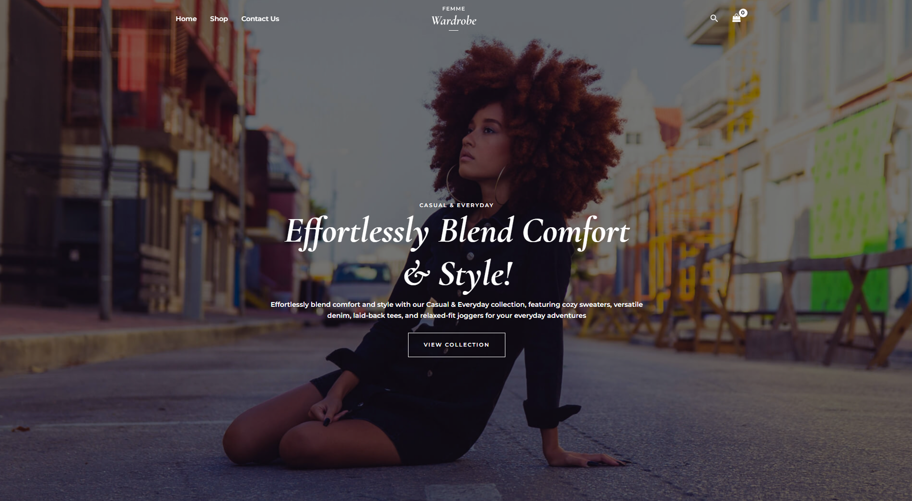
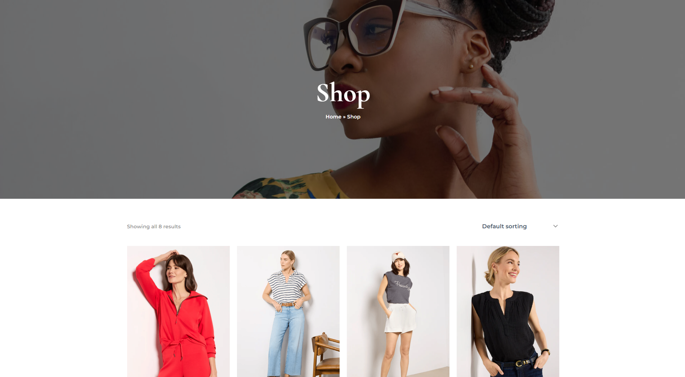
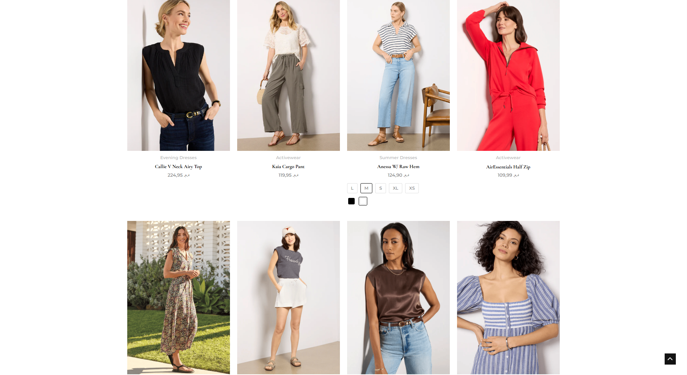

# 🛍️ FashionVerse – E-Commerce Clothing Store

A modern and responsive e-commerce website built using **WordPress**, **WooCommerce**, and the **Astra theme**, designed to showcase and sell clothing products. The project demonstrates skills in CMS setup, theme customization, plugin integration, and frontend product presentation.

---

## 📸 Demo Preview

---

## 🧰 Tech Stack

- **CMS:** WordPress
- **eCommerce Engine:** WooCommerce
- **Theme:** Astra (customized)
- **Page Builder:** Elementor
- **Server:** XAMPP (Localhost for development)

---

## 💡 Features

- Clean and modern clothing store layout
- Custom product descriptions and imagery
- Cart and checkout functionality
- Responsive design for mobile and desktop
- "Contact Us" page with form integration
- Admin bar hidden for a cleaner user experience
- Organized categories (e.g. Tops, Bottoms, Dresses)

---

## ⚙️ Installation Instructions

1. **Clone or download** this repository.
2. Set up a local server with **XAMPP** or **LocalWP**.
3. Place the project folder in the `htdocs` directory.
4. Create a MySQL database named `ecommerce_db` and import the SQL file from `/db/ecommerce_db.sql` using phpMyAdmin.
5. Update the `wp-config.php` file with your local database credentials.
6. Visit `http://localhost/wordpress-ecommerce` in your browser.

---

## 🎯 Purpose of the Project

This project was built as part of a personal portfolio to demonstrate:

- Proficiency with CMS-based development (WordPress)
- eCommerce configuration using WooCommerce
- UI/UX customization with Elementor & Astra
- Deployment and hosting management
- Real-world store setup workflow